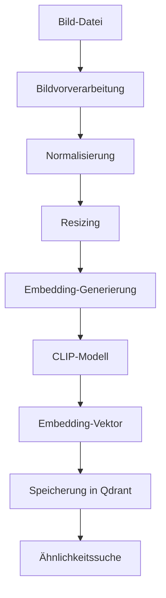

# Image Embedding Service

Der Image Embedding Service ist ein zentraler Bestandteil des GenericRAG-Systems, der für die Generierung von Embeddings für Bilder verantwortlich ist. Dieser Service verwendet CLIP-Modelle, um semantische Repräsentationen von Bildern zu erstellen, die für die Bildsuche und -analyse verwendet werden können.

## Übersicht

Der Image Embedding Service bietet folgende Funktionen:

- **Bild-Embedding-Generierung**: Erstellt hochdimensionale Vektoren aus Bildern
- **Multi-Modal Embeddings**: Unterstützt die Verbindung von Bildern und Text
- **Batch-Verarbeitung**: Effiziente Verarbeitung mehrerer Bilder gleichzeitig
- **Bildvorverarbeitung**: Normalisiert und bereitet Bilder für die Embedding-Generierung vor
- **Ähnlichkeitssuche**: Bietet Funktionen für die Bildähnlichkeitssuche
- **Metadatenextraktion**: Extrahiert zusätzliche Informationen aus Bildern

## Architektur



## Konfiguration

### Umgebungsvariablen

| Variable | Beschreibung | Standardwert |
|----------|-------------|-------------|
| `CLIP_MODEL_NAME` | CLIP-Modellname | `clip-vit-base-patch32` |
| `CLIP_DIMENSION` | Embedding-Dimension | `512` |
| `CLIP_OLLAMA_ENDPOINT` | Ollama-Endpunkt | `http://localhost:11434` |

### Konfigurationsparameter

```python
CLIP_CONFIG = {
    "model_name": "clip-vit-base-patch32",      # CLIP-Modell
    "dimension": 512,                           # Embedding-Dimension
    "ollama_endpoint": "http://localhost:11434", # Ollama-Endpunkt
    "image_size": 224,                          # Bildgröße für Verarbeitung
    "batch_size": 32,                           # Batch-Größe für Verarbeitung
    "max_image_size": 1333,                     # Maximale Bildgröße
    "min_image_size": 224,                      # Minimale Bildgröße
    "normalize_embeddings": True,               # Embeddings normalisieren
    "use_gpu": True,                            # GPU für Verarbeitung verwenden
    "cache_embeddings": True,                   # Embeddings cachen
    "cache_directory": "./data/embeddings",     # Cache-Verzeichnis
    "temp_directory": "./data/temp",           # Temporäres Verzeichnis
    "supported_formats": [".jpg", ".jpeg", ".png", ".bmp", ".tiff"], # Unterstützte Formate
    "max_file_size": 10485760,                  # Maximale Dateigröße (10MB)
    "quality_threshold": 0.5,                   # Qualitäts-Schwellenwert
    "enable_metadata_extraction": True,         # Metadaten-Extraktion aktivieren
    "parallel_processing": True,                # Parallelverarbeitung aktivieren
    "max_workers": 4,                           # Maximale Worker-Anzahl
    "timeout": 30,                              # Timeout für Anfragen
    "retry_attempts": 3,                        # Wiederholungsversuche
    "retry_delay": 1.0,                         # Verzögerung zwischen Versuchen
}
```

## Installation

Der Image Embedding Service erfordert folgende Abhängigkeiten:

```bash
# Installieren der notwendigen Pakete
uv add torch Pillow numpy
```

## Verwendung

### Grundlegende Verwendung

```python
from src.app.services.image_embedding_service import ImageEmbeddingService

# Initialisierung des Services
image_service = ImageEmbeddingService()

# Bild-Embedding generieren
image_path = "example.jpg"
embedding = await image_service.generate_embedding_from_image_path(image_path)

print(f"Embedding-Dimension: {len(embedding)}")
print(f"Embedding: {embedding[:10]}...")  # Erste 10 Werte
```

### Fortgeschrittene Verwendung

```python
# Mit benutzerdefinierter Konfiguration
config = {
    "model_name": "clip-vit-large-patch14",
    "dimension": 768,
    "batch_size": 16,
    "use_gpu": False,
    "normalize_embeddings": True
}

image_service = ImageEmbeddingService(config)

# Bild-Embedding mit Metadaten generieren
result = await image_service.generate_embedding_from_image_path(
    "example.jpg",
    include_metadata=True
)

print(f"Embedding: {result['embedding']}")
print(f"Metadaten: {result['metadata']}")
```

### Batch-Verarbeitung

```python
# Mehrere Bilder verarbeiten
image_paths = ["image1.jpg", "image2.jpg", "image3.jpg"]
embeddings = await image_service.batch_generate_embeddings(image_paths)

# Ergebnisse verarbeiten
for i, (path, embedding) in enumerate(zip(image_paths, embeddings)):
    print(f"Bild {i+1}: {path}")
    print(f"Embedding-Dimension: {len(embedding)}")
    print("-" * 30)
```

### Bildähnlichkeitssuche

```python
# Ähnlichkeitsberechnung
query_embedding = await image_service.generate_embedding_from_image_path("query.jpg")
candidate_embeddings = [embedding1, embedding2, embedding3]

similarities = await image_service.calculate_similarities(
    query_embedding, candidate_embeddings
)

# Ergebnisse sortieren
sorted_results = sorted(zip(similarities, candidate_embeddings), reverse=True)
for similarity, embedding in sorted_results:
    print(f"Ähnlichkeit: {similarity:.4f}")
```

## API-Endpunkte

### Bild-Embedding-Generierung

```http
POST /api/v1/embeddings/image
Content-Type: application/json

{
  "image_path": "path/to/image.jpg",
  "include_metadata": true,
  "normalize": true
}
```

### Batch-Bild-Embedding-Generierung

```http
POST /api/v1/embeddings/image/batch
Content-Type: application/json

{
  "image_paths": ["path/to/image1.jpg", "path/to/image2.jpg"],
  "include_metadata": true,
  "normalize": true
}
```

### Bildähnlichkeitssuche

```http
POST /api/v1/search/image
Content-Type: application/json

{
  "query_image_path": "path/to/query.jpg",
  "candidate_image_paths": ["path/to/candidate1.jpg", "path/to/candidate2.jpg"],
  "top_k": 5
}
```

## Methodenreferenz

### `generate_embedding_from_image_path(image_path: str, include_metadata: bool = False) -> Union[List[float], Dict]`

Generiert ein Embedding für ein Bild aus einer Datei.

**Parameter:**
- `image_path`: Pfad zur Bilddatei
- `include_metadata`: Ob Metadaten zurückgegeben werden sollen

**Rückgabewert:**
- `List[float]` oder `Dict`: Embedding-Vektor oder Ergebnis mit Metadaten

### `generate_embedding_from_image_bytes(image_bytes: bytes, include_metadata: bool = False) -> Union[List[float], Dict]`

Generiert ein Embedding für ein Bild aus Byte-Daten.

**Parameter:**
- `image_bytes`: Bilddaten als Bytes
- `include_metadata`: Ob Metadaten zurückgegeben werden sollen

**Rückgabewert:**
- `List[float]` oder `Dict`: Embedding-Vektor oder Ergebnis mit Metadaten

### `batch_generate_embeddings(image_paths: List[str], include_metadata: bool = False) -> List[Union[List[float], Dict]]`

Generiert Embeddings für mehrere Bilder im Batch.

**Parameter:**
- `image_paths`: Liste von Bildpfaden
- `include_metadata`: Ob Metadaten zurückgegeben werden sollen

**Rückgabewert:**
- `List[Union[List[float], Dict]]`: Liste von Embeddings oder Ergebnissen mit Metadaten

### `calculate_similarities(query_embedding: List[float], candidate_embeddings: List[List[float]]) -> List[float]`

Berechnet die Ähnlichkeit zwischen einem Query-Embedding und mehreren Candidate-Embeddings.

**Parameter:**
- `query_embedding`: Query-Embedding-Vektor
- `candidate_embeddings`: Liste von Candidate-Embedding-Vektoren

**Rückgabewert:**
- `List[float]`: Liste von Ähnlichkeitsscores

### `find_similar_images(query_embedding: List[float], image_embeddings: Dict[str, List[float]], top_k: int = 5) -> List[Tuple[str, float]]`

Findet die ähnlichsten Bilder zu einem Query-Embedding.

**Parameter:**
- `query_embedding`: Query-Embedding-Vektor
- `image_embeddings`: Dictionary mit Bildpfaden als Schlüsseln und Embeddings als Werten
- `top_k`: Anzahl der ähnlichsten Bilder, die zurückgegeben werden sollen

**Rückgabewert:**
- `List[Tuple[str, float]]`: Liste von Tupeln mit Bildpfaden und Ähnlichkeitsscores

### `preprocess_image(image_path: str) -> PIL.Image.Image`

Vorverarbeitet ein Bild für die Embedding-Generierung.

**Parameter:**
- `image_path`: Pfad zur Bilddatei

**Rückgabertyp:**
- `PIL.Image.Image`: Vorverarbeitetes Bild

### `extract_image_metadata(image_path: str) -> Dict[str, Any]`

Extrahiert Metadaten aus einem Bild.

**Parameter:**
- `image_path`: Pfad zur Bilddatei

**Rückgabertyp:**
- `Dict[str, Any]`: Extrahierte Metadaten

## Datenstrukturen

### `ImageEmbeddingResult`

```python
class ImageEmbeddingResult:
    embedding: List[float]              # Generiertes Embedding
    image_path: str                     # Pfad zum Bild
    image_id: str                       # Eindeutige Bild-ID
    metadata: Dict[str, Any]            # Bildmetadaten
    processing_time: float              # Verarbeitungszeit
    model_name: str                     # Verwendetes Modell
    dimension: int                      # Embedding-Dimension
    normalized: bool                    # Ob das Embedding normalisiert ist
    confidence: float                   # Verarbeitungsqualität
    error: Optional[str]                | Aufgetretener Fehler
```

### `ImageMetadata`

```python
class ImageMetadata:
    width: int                          # Bildbreite
    height: int                         # Bildhöhe
    format: str                         # Bildformat
    mode: str                           # Bildmodus (RGB, RGBA, etc.)
    size: int                           # Dateigröße in Bytes
    dpi: Optional[Tuple[int, int]]      # Auflösung
    creation_date: Optional[str]        | Erstellungsdatum
    modification_date: Optional[str]    | Änderungsdatum
    camera_info: Optional[Dict]         | Kamerainformationen
    gps_info: Optional[Dict]            | GPS-Informationen
```

### `SimilarityResult`

```python
class SimilarityResult:
    image_path: str                     # Pfad zum Bild
    similarity_score: float             # Ähnlichkeitsscore
    rank: int                           # Rang in der Ergebnisliste
    embedding: List[float]              | Embedding des Bildes
    metadata: Dict[str, Any]            | Zusätzliche Metadaten
```

## Bildvorverarbeitung

### Standardvorverarbeitung

```python
# Bild vorverarbeiten
processed_image = await image_service.preprocess_image("example.jpg")

# Vorverarbeitetes Bild anzeigen
processed_image.show()
```

### Benutzerdefinierte Vorverarbeitung

```python
# Mit benutzerdefinierter Konfiguration
config = {
    "image_size": 256,
    "normalize": True,
    "convert_to_rgb": True,
    "apply_augmentation": False
}

image_service = ImageEmbeddingService(config)
processed_image = await image_service.preprocess_image("example.jpg")
```

### Batch-Vorverarbeitung

```python
# Mehrere Bilder vorverarbeiten
image_paths = ["image1.jpg", "image2.jpg", "image3.jpg"]
processed_images = await image_service.batch_preprocess_images(image_paths)

# Ergebnisse verarbeiten
for i, (path, image) in enumerate(zip(image_paths, processed_images)):
    print(f"Bild {i+1}: {path}")
    print(f"Größe: {image.size}")
    print(f"Modus: {image.mode}")
    print("-" * 30)
```

## Metadatenextraktion

### Automatische Metadatenextraktion

```python
# Metadaten extrahieren
metadata = await image_service.extract_image_metadata("example.jpg")

print(f"Größe: {metadata['width']}x{metadata['height']}")
print(f"Format: {metadata['format']}")
print(f"Dateigröße: {metadata['size']} Bytes")
print(f"Modus: {metadata['mode']}")
```

### Erweiterte Metadatenextraktion

```python
# Erweiterte Metadaten extrahieren
extended_metadata = await image_service.extract_extended_metadata("example.jpg")

print(f"Kamerainformationen: {extended_metadata['camera_info']}")
print(f"GPS-Informationen: {extended_metadata['gps_info']}")
print(f"Erstellungsdatum: {extended_metadata['creation_date']}")
```

## Ähnlichkeitssuche

### Kosinus-Ähnlichkeit

```python
# Kosinus-Ähnlichkeit berechnen
query_embedding = [0.1, 0.2, 0.3, 0.4, 0.5]
candidate_embedding = [0.2, 0.3, 0.4, 0.5, 0.6]

similarity = await image_service.calculate_cosine_similarity(
    query_embedding, candidate_embedding
)

print(f"Kosinus-Ähnlichkeit: {similarity:.4f}")
```

### Top-Ähnlichkeits-Suche

```python
# Ähnlichste Bilder finden
query_embedding = await image_service.generate_embedding_from_image_path("query.jpg")
image_embeddings = {
    "image1.jpg": await image_service.generate_embedding_from_image_path("image1.jpg"),
    "image2.jpg": await image_service.generate_embedding_from_image_path("image2.jpg"),
    "image3.jpg": await image_service.generate_embedding_from_image_path("image3.jpg")
}

similar_images = await image_service.find_similar_images(
    query_embedding, image_embeddings, top_k=2
)

for image_path, score in similar_images:
    print(f"Bild: {image_path}, Ähnlichkeit: {score:.4f}")
```

## Performance-Optimierung

### Caching

```python
# Caching aktivieren
image_service = ImageEmbeddingService(cache_embeddings=True)

# Cache leeren
image_service.clear_cache()
```

### Parallelverarbeitung

```python
# Parallelverarbeitung für Batch-Operationen
config = {
    "parallel_processing": True,
    "max_workers": 8,
    "batch_size": 64
}

image_service = ImageEmbeddingService(config)
embeddings = await image_service.batch_generate_embeddings(large_image_list)
```

### GPU-Beschleunigung

```python
# GPU für Verarbeitung verwenden
config = {
    "use_gpu": True,
    "gpu_device": "cuda:0"
}

image_service = ImageEmbeddingService(config)
embedding = await image_service.generate_embedding_from_image_path("example.jpg")
```

## Beispiele

### Beispiel 1: Einfache Bild-Embedding-Generierung

```python
from src.app.services.image_embedding_service import ImageEmbeddingService

# Service initialisieren
image_service = ImageEmbeddingService()

# Bild-Embedding generieren
image_path = "example.jpg"
embedding = await image_service.generate_embedding_from_image_path(image_path)

print(f"Embedding generiert mit {len(embedding)} Dimensionen")
print(f"Erste 10 Werte: {embedding[:10]}")
```

### Beispiel 2: Batch-Bild-Verarbeitung

```python
# Mehrere Bilder verarbeiten
image_paths = [
    "image1.jpg",
    "image2.jpg", 
    "image3.jpg",
    "image4.jpg"
]

# Embeddings generieren
embeddings = await image_service.batch_generate_embeddings(image_paths)

# Ergebnisse analysieren
for i, (path, embedding) in enumerate(zip(image_paths, embeddings)):
    print(f"Bild {i+1}: {path}")
    print(f"  - Dimensionen: {len(embedding)}")
    print(f"  - Verarbeitungszeit: {embeddings[i]['processing_time']:.2f}s")
    print("-" * 30)
```

### Beispiel 3: Bildähnlichkeitssuche

```python
# Query-Bild
query_path = "query.jpg"
query_embedding = await image_service.generate_embedding_from_image_path(query_path)

# Kandidaten-Bilder
candidate_paths = ["candidate1.jpg", "candidate2.jpg", "candidate3.jpg"]
candidate_embeddings = []

for path in candidate_paths:
    embedding = await image_service.generate_embedding_from_image_path(path)
    candidate_embeddings.append(embedding)

# Ähnlichkeiten berechnen
similarities = await image_service.calculate_similarities(
    query_embedding, candidate_embeddings
)

# Ergebnisse sortieren und anzeigen
results = list(zip(candidate_paths, similarities))
results.sort(key=lambda x: x[1], reverse=True)

print("Ähnlichste Bilder:")
for path, similarity in results:
    print(f"  {path}: {similarity:.4f}")
```

### Beispiel 4: Metadatenanalyse

```python
# Metadaten extrahieren und analysieren
image_path = "example.jpg"
metadata = await image_service.extract_image_metadata(image_path)

print("Bildmetadaten:")
for key, value in metadata.items():
    print(f"  {key}: {value}")

# Erweiterte Metadaten extrahieren
extended_metadata = await image_service.extract_extended_metadata(image_path)
print("\nErweiterte Metadaten:")
for key, value in extended_metadata.items():
    if value:
        print(f"  {key}: {value}")
```

### Beispiel 5: Bildsuche mit Text-Query

```python
# Text-Query für Bildsuche
text_query = "Ein rotes Auto auf einer Straße"

# Text-Embedding generieren (angenommen, wir haben einen Text-Embedding-Service)
text_embedding = await text_service.generate_embedding(text_query)

# Bild-Embeddings durchsuchen
image_embeddings = {
    "car1.jpg": await image_service.generate_embedding_from_image_path("car1.jpg"),
    "car2.jpg": await image_service.generate_embedding_from_image_path("car2.jpg"),
    "nature1.jpg": await image_service.generate_embedding_from_image_path("nature1.jpg")
}

# Ähnlichste Bilder finden
similar_images = await image_service.find_similar_images(
    text_embedding, image_embeddings, top_k=2
)

print(f"Ähnlichste Bilder zu '{text_query}':")
for image_path, score in similar_images:
    print(f"  {image_path}: {score:.4f}")
```

## Troubleshooting

### Häufige Probleme

1. **Bild kann nicht geladen werden**
   - Lösung: Dateiformat und Dateipfad überprüfen
   - Alternative: Andere Bildbibliothek verwenden (z.B. `opencv-python`)

2. **Embedding-Generierung ist zu langsam**
   - Lösung: GPU-Beschleunigung aktivieren oder Batch-Größe erhöhen
   - Alternative: Kleinere CLIP-Modelle verwenden

3. **Qualität der Embeddings ist niedrig**
   - Lösung: Bildvorverarbeitung optimieren oder größeres CLIP-Modell verwenden
   - Alternative: Andere Metriken für Ähnlichkeit verwenden

4. **Speicherplatzmangel**
   - Lösung: Caching deaktivieren oder Cache-Verzeichnis bereinigen
   - Alternative: Embeddings in Datenbank speichern

### Debug-Modus

```python
# Debug-Informationen aktivieren
image_service = ImageEmbeddingService(debug=True)
embedding = await image_service.generate_embedding_from_image_path("example.jpg")

# Detaillierte Logs anzeigen
for log in embedding['metadata']['debug_logs']:
    print(f"{log['timestamp']}: {log['message']}")
```

## Weiterführende Informationen

- [CLIP-Dokumentation](https://openai.com/clip/)
- [PyTorch-Dokumentation](https://pytorch.org/)
- [Pillow-Dokumentation](https://pillow.readthedocs.io/)
- [Image Embedding Best Practices](https://towardsdatascience.com/image-embeddings-with-clip-4a88f7e20b62)
- [Similarity Search Techniques](https://towardsdatascience.com/cosine-similarity-how-does-it-work-626a14be7fa6)