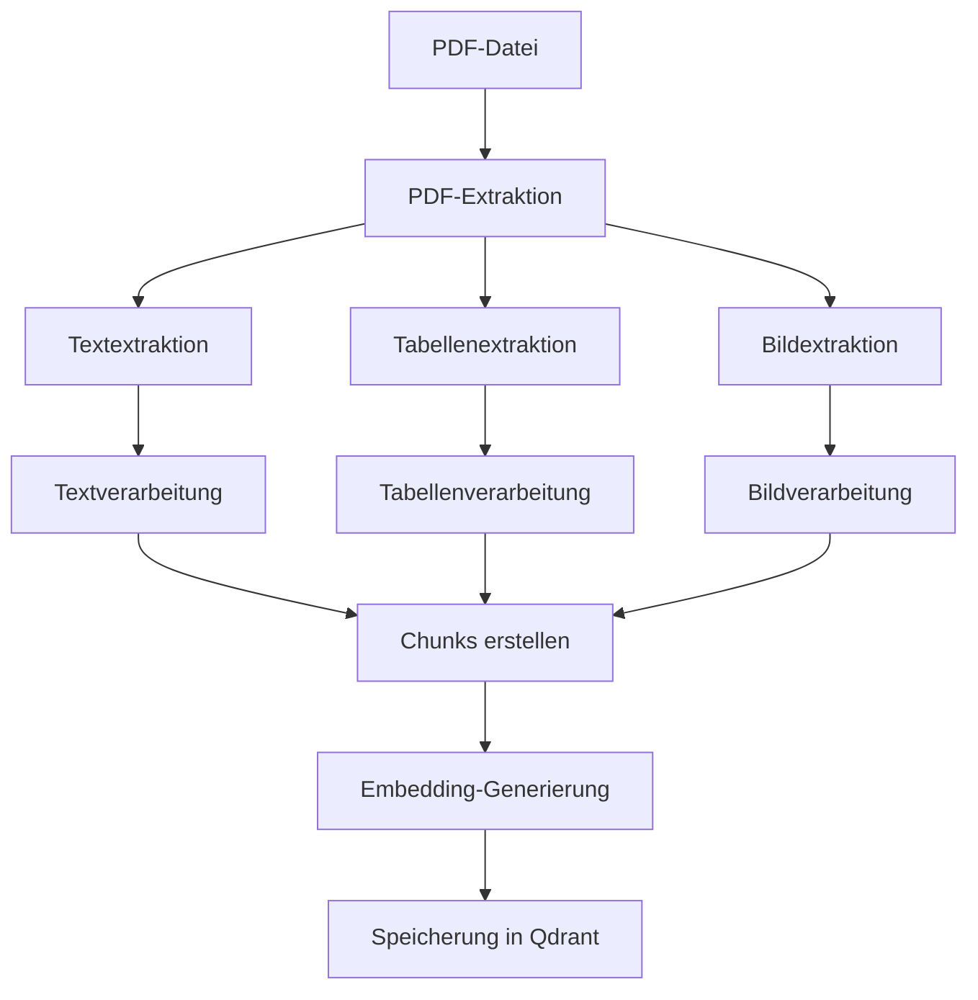

# PDF-Extractor Service

Der PDF-Extractor Service ist ein zentraler Bestandteil des GenericRAG-Systems, der für die Verarbeitung von PDF-Dokumenten verantwortlich ist. Dieser Service extrahiert Text, Tabellen und Bilder aus PDF-Dateien und bereitet sie für die weitere Verarbeitung im RAG-System vor.

## Übersicht

Der PDF-Extractor Service bietet folgende Funktionen:

- **Textextraktion**: Extrahiert lesbaren Text aus PDF-Seiten
- **Tabellenextraktion**: Erkennt und extrahiert strukturierte Tabellen
- **Bildextraktion**: Extrahiert Bilder aus PDF-Seiten
- **Seitenverarbeitung**: Verarbeitet jede Seite einzeln mit hoher Auflösung
- **Batch-Verarbeitung**: Unterstützt die Verarbeitung mehrerer PDF-Dateien gleichzeitig
- **Fehlerbehandlung**: Robuste Fehlerbehandlung für verschiedene PDF-Formate

## Architektur



## Konfiguration

### Umgebungsvariablen

| Variable | Beschreibung | Standardwert |
|----------|-------------|-------------|
| `PDF_EXTRACTOR_CONFIG` | Konfiguration für den PDF-Extractor | `{"max_pages": 100, "dpi": 300, "extract_tables": true, "extract_images": true}` |

### Konfigurationsparameter

```python
PDF_EXTRACTOR_CONFIG = {
    "max_pages": 100,           # Maximale Seitenanzahl pro PDF
    "dpi": 300,                # Auflösung für Bildkonvertierung
    "extract_tables": True,    # Tabellenextraktion aktivieren
    "extract_images": True,    # Bildextraktion aktivieren
    "text_cleaning": True,     # Textbereinigung aktivieren
    "chunk_size": 512,         # Größe der Text-Chunks
    "chunk_overlap": 50,       # Überlappung zwischen Chunks
    "table_detection_threshold": 0.8,  # Schwellenwert für Tabellenerkennung
    "image_format": "png",     # Format für extrahierte Bilder
    "temp_directory": "./data/temp"  # Temporärer Speicherort
}
```

## Installation

Der PDF-Extractor Service erfordert folgende Abhängigkeiten:

```bash
# Installieren der notwendigen Pakete
uv add pdfplumber PyMuPDF pdf2image
```

## Verwendung

### Grundlegende Verwendung

```python
from src.app.services.pdf_extractor import PDFExtractor

# Initialisierung des Services
extractor = PDFExtractor()

# PDF-Datei verarbeiten
result = await extractor.extract_pdf("document.pdf")

# Ergebnis verarbeiten
for page in result.pages:
    print(f"Seite {page.page_number}: {len(page.text)} Zeichen")
    print(f"Tabellen: {len(page.tables)}")
    print(f"Bilder: {len(page.images)}")
```

### Batch-Verarbeitung

```python
# Mehrere PDF-Dateien verarbeiten
pdf_files = ["doc1.pdf", "doc2.pdf", "doc3.pdf"]
results = await extractor.batch_extract(pdf_files)

# Ergebnisse verarbeiten
for i, result in enumerate(results):
    print(f"Dokument {i+1}: {len(result.pages)} Seiten")
```

### Fortgeschrittene Verwendung

```python
# Mit benutzerdefinierter Konfiguration
config = {
    "max_pages": 50,
    "dpi": 600,
    "extract_tables": True,
    "extract_images": True,
    "chunk_size": 1024,
    "chunk_overlap": 100
}

extractor = PDFExtractor(config)
result = await extractor.extract_pdf("document.pdf")

# Ergebnisse filtern und verarbeiten
text_chunks = [chunk for chunk in result.chunks if chunk.chunk_type == "text"]
table_chunks = [chunk for chunk in result.chunks if chunk.chunk_type == "table"]
image_chunks = [chunk for chunk in result.chunks if chunk.chunk_type == "image"]
```

## API-Endpunkte

### PDF-Extraktion

```http
POST /api/v1/ingest
Content-Type: multipart/form-data

{
  "file": [PDF-Datei],
  "session_id": "session-123"
}
```

### Batch-PDF-Extraktion

```http
POST /api/v1/ingest/batch
Content-Type: multipart/form-data

{
  "files": [PDF-Datei1, PDF-Datei2, PDF-Datei3],
  "session_id": "session-123"
}
```

### Dokument-Details

```http
GET /api/v1/sessions/{session_id}/documents/{document_id}
```

## Methodenreferenz

### `extract_pdf(pdf_path: str) -> PDFExtractionResult`

Extrahiert Inhalte aus einer einzelnen PDF-Datei.

**Parameter:**
- `pdf_path`: Pfad zur PDF-Datei

**Rückgabewert:**
- `PDFExtractionResult`: Objekt mit extrahierten Inhalten

### `batch_extract(pdf_paths: List[str]) -> List[PDFExtractionResult]`

Extrahiert Inhalte aus mehreren PDF-Dateien.

**Parameter:**
- `pdf_paths`: Liste von Pfaden zu PDF-Dateien

**Rückgabewert:**
- `List[PDFExtractionResult]`: Liste von Extraktionsergebnissen

### `extract_text_from_page(page) -> str`

Extrahiert Text aus einer PDF-Seite.

**Parameter:**
- `page`: PDF-Seitenobjekt

**Rückgabertyp:**
- `str`: Extrahierter Text

### `extract_tables_from_page(page) -> List[Table]`

Extrahiert Tabellen aus einer PDF-Seite.

**Parameter:**
- `page`: PDF-Seitenobjekt

**Rückgabertyp:**
- `List[Table]`: Liste von extrahierten Tabellen

### `extract_images_from_page(page) -> List[Image]`

Extrahiert Bilder aus einer PDF-Seite.

**Parameter:**
- `page`: PDF-Seitenobjekt

**Rückgabertyp:**
- `List[Image]`: Liste von extrahierten Bildern

### `create_chunks(content: str, chunk_type: str) -> List[Chunk]`

Erstellt Text-Chunks aus extrahiertem Inhalt.

**Parameter:**
- `content`: Zu verarbeitender Text
- `chunk_type`: Typ des Chunks (text, table, image)

**Rückgabertyp:**
- `List[Chunk]`: Liste von Text-Chunks

## Datenstrukturen

### `PDFExtractionResult`

```python
class PDFExtractionResult:
    pdf_path: str
    total_pages: int
    pages: List[PDFPage]
    chunks: List[Chunk]
    metadata: Dict[str, Any]
    processing_time: float
    errors: List[str]
```

### `PDFPage`

```python
class PDFPage:
    page_number: int
    text: str
    tables: List[Table]
    images: List[Image]
    metadata: Dict[str, Any]
```

### `Table`

```python
class Table:
    table_id: str
    page_number: int
    content: List[List[str]]
    bbox: Tuple[float, float, float, float]
    confidence: float
```

### `Image`

```python
class Image:
    image_id: str
    page_number: int
    content: bytes
    format: str
    bbox: Tuple[float, float, float, float]
    size: Tuple[int, int]
```

### `Chunk`

```python
class Chunk:
    chunk_id: str
    content: str
    chunk_type: str  # text, table, image
    page_number: int
    document_name: str
    session_id: str
    metadata: Dict[str, Any]
    embedding: Optional[List[float]]
```

## Fehlerbehandlung

Der PDF-Extractor Service implementiert eine robuste Fehlerbehandlung:

```python
try:
    result = await extractor.extract_pdf("document.pdf")
    if result.errors:
        for error in result.errors:
            print(f"Fehler: {error}")
    else:
        print("Extraktion erfolgreich abgeschlossen")
except Exception as e:
    print(f"Kritischer Fehler bei der Extraktion: {e}")
```

### Mögliche Fehler

- **PDF nicht lesbar**: Die PDF-Datei ist beschädigt oder hat ein unbekanntes Format
- **Seitenlimit überschritten**: Die PDF-Datei enthält mehr Seiten als das erlaubte Limit
- **Speicherplatzmangel**: Nicht genügend Speicherplatz für die Verarbeitung
- **Timeout**: Die Verarbeitung dauert länger als das erlaubte Zeitlimit

## Performance-Optimierung

### Empfohlene Einstellungen

Für große PDF-Dateien:

```python
config = {
    "max_pages": 200,
    "dpi": 150,  # Reduzierte Auflösung für schnellere Verarbeitung
    "extract_tables": True,
    "extract_images": True,
    "chunk_size": 1024,
    "chunk_overlap": 100,
    "parallel_processing": True,
    "max_workers": 4
}
```

### Speicheroptimierung

```python
# Temporäre Dateien bereinigen
await extractor.cleanup_temp_files()

# Zwischenspeicher leeren
extractor.clear_cache()
```

## Beispiele

### Beispiel 1: Einfache Textextraktion

```python
from src.app.services.pdf_extractor import PDFExtractor

extractor = PDFExtractor()
result = await extractor.extract_pdf("report.pdf")

# Extrahierten Text anzeigen
for page in result.pages:
    print(f"Seite {page.page_number}:")
    print(page.text[:500])  # Erste 500 Zeichen
    print("-" * 50)
```

### Beispiel 2: Tabellenextraktion

```python
extractor = PDFExtractor()
result = await extractor.extract_pdf("tables.pdf")

# Tabellen verarbeiten
for page in result.pages:
    for table in page.tables:
        print(f"Tabelle auf Seite {page.page_number}:")
        for row in table.content:
            print(" | ".join(row))
        print("-" * 50)
```

### Beispiel 3: Bildextraktion

```python
extractor = PDFExtractor()
result = await extractor.extract_pdf("images.pdf")

# Bilder speichern
for page in result.pages:
    for image in page.images:
        image_path = f"extracted_image_{image.image_id}.png"
        with open(image_path, "wb") as f:
            f.write(image.content)
        print(f"Bild gespeichert: {image_path}")
```

### Beispiel 4: Komplexe Verarbeitung

```python
from src.app.services.text_preprocessor import TextPreprocessor
from src.app.services.image_embedding_service import ImageEmbeddingService

# Services initialisieren
extractor = PDFExtractor()
preprocessor = TextPreprocessor()
image_service = ImageEmbeddingService()

# PDF verarbeiten
result = await extractor.extract_pdf("complex_document.pdf")

# Text-Chunks vorverarbeiten
text_chunks = []
for chunk in result.chunks:
    if chunk.chunk_type == "text":
        processed_chunk = await preprocessor.preprocess_text(chunk.content)
        text_chunks.append(processed_chunk)

# Bilder verarbeiten
image_embeddings = []
for page in result.pages:
    for image in page.images:
        embedding = await image_service.generate_embedding_from_image(image.content)
        image_embeddings.append(embedding)

print(f"Verarbeitet: {len(text_chunks)} Text-Chunks, {len(image_embeddings)} Bild-Embeddings")
```

## Troubleshooting

### Häufige Probleme

1. **PDF kann nicht geöffnet werden**
   - Lösung: PDF-Datei auf Beschädigung prüfen
   - Alternative: Andere PDF-Bibliothek versuchen (z.B. `pdfminer`)

2. **Tabellen werden nicht erkannt**
   - Lösung: `table_detection_threshold` anpassen
   - Alternative: Manuelle Tabellenerkennung implementieren

3. **Bilder haben schlechte Qualität**
   - Lösung: `dpi` Wert erhöhen
   - Alternative: Nachbearbeitung der Bilder implementieren

4. **Speicherplatzmangel**
   - Lösung: Temporäre Dateien bereinigen
   - Alternative: Verarbeitung in Chunks durchführen

### Debug-Modus

```python
# Debug-Informationen aktivieren
extractor = PDFExtractor(debug=True)
result = await extractor.extract_pdf("document.pdf")

# Detaillierte Logs anzeigen
for log in result.metadata["debug_logs"]:
    print(f"{log['timestamp']}: {log['message']}")
```

## Weiterführende Informationen

- [PDF-Extraktions-Bibliotheken](https://pdfplumber.readthedocs.io/)
- [PyMuPDF-Dokumentation](https://pymupdf.readthedocs.io/)
- [pdf2image-Dokumentation](https://pdf2image.readthedocs.io/)
- [Qdrant-Dokumentation](https://qdrant.tech/documentation/)