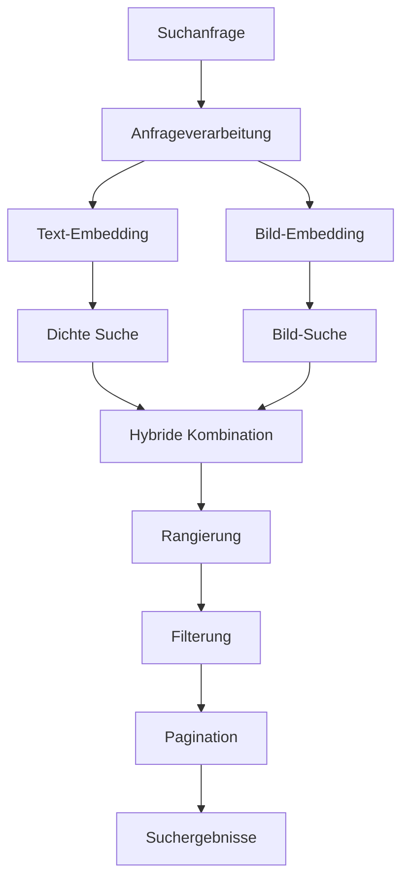

# Search Service

Der Search Service ist ein zentraler Bestandteil des GenericRAG-Systems, der für die hybride Suche durch Text- und Bild-Embeddings verantwortlich ist. Dieser Service kombiniert dichte und sparse Embeddings, um präzise und relevante Suchergebnisse zu liefern.

## Übersicht

Der Search Service bietet folgende Funktionen:

- **Hybride Suche**: Kombiniert dichte und sparse Embeddings für optimale Ergebnisse
- **Mehrmodalität**: Unterstützt die Suche nach Text und Bildern
- **Semantische Suche**: Basiert auf semantischer Ähnlichkeit statt nur Schlüsselwörtern
- **Rangierung**: Intelligente Sortierung der Suchergebnisse nach Relevanz
- **Filterung**: Flexible Filterung nach verschiedenen Kriterien
- **Pagination**: Unterstützung für paginierte Ergebnisse

## Architektur



## Konfiguration

### Umgebungsvariablen

| Variable | Beschreibung | Standardwert |
|----------|-------------|-------------|
| `SEARCH_SERVICE_CONFIG` | Konfiguration für den Search Service | `{"dense_weight": 0.7, "sparse_weight": 0.3, "max_results": 10, "similarity_threshold": 0.5}` |

### Konfigurationsparameter

```python
SEARCH_SERVICE_CONFIG = {
    "dense_weight": 0.7,                    # Gewichtung für dichte Embeddings
    "sparse_weight": 0.3,                   # Gewichtung für sparse Embeddings
    "max_results": 10,                      # Maximale Anzahl der Ergebnisse
    "similarity_threshold": 0.5,            # Ähnlichkeitsschwelle
    "fusion_method": "weighted_sum",        # Fusionsmethode (weighted_sum, rank_fusion, reciprocal_rank_fusion)
    "search_type": "hybrid",                # Suchtyp (hybrid, dense, sparse)
    "enable_text_search": True,             # Textsuche aktivieren
    "enable_image_search": True,            # Bildsuche aktivieren
    "enable_hybrid_search": True,           # Hybride Suche aktivieren
    "chunk_size": 512,                      # Größe der Text-Chunks
    "chunk_overlap": 50,                    # Überlappung zwischen Chunks
    "search_timeout": 30,                   # Timeout für Suchanfragen
    "cache_results": True,                  # Suchergebnisse cachen
    "cache_ttl": 3600,                      # Cache-TTL in Sekunden
    "enable_debug_logging": False,          # Debug-Logging aktivieren
    "parallel_search": True,                # Parallele Suche aktivieren
    "max_workers": 4,                       # Maximale Worker-Anzahl
    "rerank_model": "cross-encoder",        # Umrangierungsmodell
    "rerank_threshold": 0.6,                # Umrangierungsschwelle
    "enable_metadata_filter": True,         # Metadaten-Filterung aktivieren
    "available_filters": ["session_id", "document", "chunk_type", "page_number"], # Verfügbare Filter
    "default_sort_by": "similarity",        # Standardsortierung
    "enable_score_normalization": True,     # Score-Normalisierung aktivieren
    "score_normalization_method": "min_max", # Normalisierungsmethode
    "enable_explainability": False,         # Erklärbarkeit aktivieren
    "explain_method": "lime",               # Erklärungsmethode
}
```

## Installation

Der Search Service erfordert folgende Abhängigkeiten:

```bash
# Installieren der notwendigen Pakete
uv add qdrant-client numpy scikit-learn rank-bm25
```

## Verwendung

### Grundlegende Verwendung

```python
from src.app.services.search_service import SearchService

# Initialisierung des Services
search_service = SearchService()

# Hybride Suche durchführen
query = "Was ist Künstliche Intelligenz?"
results = await search_service.hybrid_search(
    query=query,
    session_id="session-123",
    max_results=5
)

# Ergebnisse anzeigen
for result in results:
    print(f"Score: {result['score']:.4f}")
    print(f"Content: {result['content'][:100]}...")
    print(f"Metadata: {result['metadata']}")
    print("-" * 50)
```

### Fortgeschrittene Verwendung

```python
# Mit benutzerdefinierter Konfiguration
config = {
    "dense_weight": 0.8,
    "sparse_weight": 0.2,
    "max_results": 10,
    "similarity_threshold": 0.6,
    "fusion_method": "rank_fusion",
    "enable_text_search": True,
    "enable_image_search": True
}

search_service = SearchService(config)

# Suche mit Filtern
results = await search_service.hybrid_search(
    query="Maschinelles Lernen",
    session_id="session-123",
    filters={
        "document": "ai_paper.pdf",
        "chunk_type": "text",
        "page_number": 1
    },
    max_results=5
)
```

### Bildsuche

```python
# Bildähnlichkeitssuche
query_image_path = "query_image.jpg"
results = await search_service.similar_image_search(
    query_image_path=query_image_path,
    session_id="session-123",
    max_results=5
)

# Ergebnisse anzeigen
for result in results:
    print(f"Similarity: {result['similarity']:.4f}")
    print(f"Image path: {result['image_path']}")
    print(f"Metadata: {result['metadata']}")
    print("-" * 50)
```

## API-Endpunkte

### Hybride Suche

```http
POST /api/v1/search/hybrid
Content-Type: application/json

{
  "query": "Suchanfrage",
  "session_id": "session-123",
  "max_results": 10,
  "filters": {
    "document": "document.pdf",
    "chunk_type": "text"
  },
  "search_type": "hybrid"
}
```

### Textsuche

```http
POST /api/v1/search/text
Content-Type: application/json

{
  "query": "Suchanfrage",
  "session_id": "session-123",
  "max_results": 10,
  "filters": {
    "document": "document.pdf"
  }
}
```

### Bildsuche

```http
POST /api/v1/search/image
Content-Type: application/json

{
  "query_image_path": "path/to/image.jpg",
  "session_id": "session-123",
  "max_results": 10
}
```

### Batch-Suche

```http
POST /api/v1/search/batch
Content-Type: application/json

{
  "queries": [
    {
      "query": "Erste Suchanfrage",
      "session_id": "session-123",
      "max_results": 5
    },
    {
      "query": "Zweite Suchanfrage", 
      "session_id": "session-123",
      "max_results": 5
    }
  ]
}
```

## Methodenreferenz

### `hybrid_search(query: str, session_id: str, max_results: int = 10, filters: Optional[Dict] = None) -> List[Dict]`

Führt eine hybride Suche durch, die dichte und sparse Embeddings kombiniert.

**Parameter:**
- `query`: Suchanfrage als Text
- `session_id`: Session-ID für die Filterung
- `max_results`: Maximale Anzahl der Ergebnisse
- `filters`: Optionale Filter für die Suche

**Rückgabewert:**
- `List[Dict]`: Liste von Suchergebnissen mit Scores und Metadaten

### `text_search(query: str, session_id: str, max_results: int = 10, filters: Optional[Dict] = None) -> List[Dict]`

Führt eine reine Textsuche durch.

**Parameter:**
- `query`: Suchanfrage als Text
- `session_id`: Session-ID für die Filterung
- `max_results`: Maximale Anzahl der Ergebnisse
- `filters`: Optionale Filter für die Suche

**Rückgabewert:**
- `List[Dict]`: Liste von Suchergebnissen mit Scores und Metadaten

### `image_search(query_image_path: str, session_id: str, max_results: int = 10) -> List[Dict]`

Führt eine Bildähnlichkeitssuche durch.

**Parameter:**
- `query_image_path`: Pfad zum Query-Bild
- `session_id`: Session-ID für die Filterung
- `max_results`: Maximale Anzahl der Ergebnisse

**Rückgabewert:**
- `List[Dict]`: Liste von Suchergebnissen mit Ähnlichkeitsscores und Metadaten

### `batch_search(queries: List[Dict]) -> List[List[Dict]]`

Führt mehrere Suchanfragen im Batch durch.

**Parameter:**
- `queries`: Liste von Suchanfragen als Dictionary

**Rückgabewert:**
- `List[List[Dict]]`: Liste von Suchergebnissen für jede Anfrage

### `fuse_results(dense_results: List[Dict], sparse_results: List[Dict], method: str = "weighted_sum") -> List[Dict]`

Kombiniert Ergebnisse aus dichter und sparser Suche.

**Parameter:**
- `dense_results`: Ergebnisse aus dichter Suche
- `sparse_results`: Ergebnisse aus sparser Suche
- `method`: Fusionsmethode

**Rückgabewert:**
- `List[Dict]`: Kombinierte und rangierte Ergebnisse

### `rerank_results(results: List[Dict], query: str) -> List[Dict]`

Rangiert Suchergebnisse neu mit einem Cross-Encoder-Modell.

**Parameter:**
- `results`: Ursprüngliche Suchergebnisse
- `query`: Suchanfrage

**Rückgabewert:**
- `List[Dict]`: Neu rangierte Ergebnisse

### `explain_result(result: Dict, query: str) -> Dict`

Erklärt, warum ein bestimmtes Ergebnis relevant ist.

**Parameter:**
- `result`: Suchergebnis
- `query`: Suchanfrage

**Rückgabertyp:**
- `Dict`: Erklärung der Relevanz

## Datenstrukturen

### `SearchResult`

```python
class SearchResult:
    id: str                              # Eindeutige ID des Ergebnisses
    content: str                         # Inhalt des Ergebnisses
    score: float                         # Relevanz-Score
    rank: int                            # Rang in der Ergebnisliste
    metadata: Dict[str, Any]             | Metadaten
    search_type: str                     # Typ der Suche (dense, sparse, hybrid)
    similarity: float                    | Ähnlichkeitsscore
    explanation: Optional[Dict]          | Erklärung der Relevanz
    processing_time: float               | Verarbeitungszeit
    confidence: float                    | Verarbeitungsqualität
```

### `SearchQuery`

```python
class SearchQuery:
    query: str                           # Suchanfrage
    session_id: str                      # Session-ID
    max_results: int                     # Maximale Ergebnisse
    filters: Dict[str, Any]              | Filter
    search_type: str                     # Suchtyp
    enable_explainability: bool          | Erklärbarkeit aktivieren
    rerank_results: bool                 | Ergebnisse umrangieren
```

### `SearchFilters`

```python
class SearchFilters:
    session_id: Optional[str]            | Session-ID Filter
    document: Optional[str]              | Dokument Filter
    chunk_type: Optional[str]            | Chunk-Type Filter
    page_number: Optional[int]           | Seitennummer Filter
    date_range: Optional[Tuple[str, str]] | Datumsbereich Filter
    score_range: Optional[Tuple[float, float]] | Score-Bereich Filter
    custom_filters: Dict[str, Any]       | Benutzerdefinierte Filter
```

## Suchstrategien

### Dichte Suche

```python
# Dichte Suche durchführen
dense_results = await search_service.dense_search(
    query_embedding=[0.1, 0.2, 0.3, ...],  # Query-Embedding
    session_id="session-123",
    max_results=10
)

# Ergebnisse anzeigen
for result in dense_results:
    print(f"Similarity: {result['similarity']:.4f}")
    print(f"Content: {result['content'][:100]}...")
```

### Sparse Suche

```python
# Sparse Suche durchführen
sparse_results = await search_service.sparse_search(
    query="Maschinelles Lernen",
    session_id="session-123",
    max_results=10
)

# Ergebnisse anzeigen
for result in sparse_results:
    print(f"BM25 Score: {result['score']:.4f}")
    print(f"Content: {result['content'][:100]}...")
```

### Hybride Suche

```python
# Hybride Suche mit verschiedenen Fusionsmethoden
results_weighted = await search_service.hybrid_search(
    query="Künstliche Intelligenz",
    session_id="session-123",
    fusion_method="weighted_sum",
    dense_weight=0.7,
    sparse_weight=0.3
)

results_rank = await search_service.hybrid_search(
    query="Künstliche Intelligenz",
    session_id="session-123",
    fusion_method="rank_fusion"
)

results_rrf = await search_service.hybrid_search(
    query="Künstliche Intelligenz",
    session_id="session-123",
    fusion_method="reciprocal_rank_fusion"
)
```

## Filterung und Sortierung

### Einfache Filterung

```python
# Suche mit einfachen Filtern
results = await search_service.hybrid_search(
    query="Deep Learning",
    session_id="session-123",
    filters={
        "document": "ai_paper.pdf",
        "chunk_type": "text"
    }
)
```

### Komplexe Filterung

```python
# Suche mit komplexen Filtern
results = await search_service.hybrid_search(
    query="Neuronale Netze",
    session_id="session-123",
    filters={
        "document": "ml_book.pdf",
        "chunk_type": "text",
        "page_number": 1,
        "score_range": (0.5, 1.0),
        "custom_filters": {
            "author": "John Doe",
            "year": 2023
        }
    }
)
```

### Sortierung

```python
# Ergebnisse nach verschiedenen Kriterien sortieren
results_similarity = await search_service.hybrid_search(
    query="Machine Learning",
    session_id="session-123",
    sort_by="similarity"
)

results_date = await search_service.hybrid_search(
    query="Machine Learning",
    session_id="session-123",
    sort_by="date"
)

results_score = await search_service.hybrid_search(
    query="Machine Learning",
    session_id="session-123",
    sort_by="score"
)
```

## Performance-Optimierung

### Caching

```python
# Caching aktivieren
search_service = SearchService(cache_results=True)

# Cache leeren
search_service.clear_cache()

# Cache-Statistiken anzeigen
stats = search_service.get_cache_stats()
print(f"Cache Hit Rate: {stats['hit_rate']:.2%}")
print(f"Cache Size: {stats['size']}")
```

### Parallele Suche

```python
# Parallele Suche aktivieren
config = {
    "parallel_search": True,
    "max_workers": 8
}

search_service = SearchService(config)

# Parallele Suche durchführen
results = await search_service.hybrid_search(
    query="Künstliche Intelligenz",
    session_id="session-123",
    max_results=20
)
```

### Batch-Verarbeitung

```python
# Batch-Suche für mehrere Anfragen
queries = [
    {"query": "Machine Learning", "session_id": "session-123"},
    {"query": "Deep Learning", "session_id": "session-123"},
    {"query": "Neural Networks", "session_id": "session-123"}
]

batch_results = await search_service.batch_search(queries)

# Ergebnisse verarbeiten
for i, results in enumerate(batch_results):
    print(f"Query {i+1}: {len(results)} Ergebnisse")
```

## Beispiele

### Beispiel 1: Einfache hybride Suche

```python
from src.app.services.search_service import SearchService

# Service initialisieren
search_service = SearchService()

# Hybride Suche durchführen
query = "Was ist Künstliche Intelligenz?"
results = await search_service.hybrid_search(
    query=query,
    session_id="session-123",
    max_results=5
)

# Ergebnisse anzeigen
print(f"Suche nach: '{query}'")
print(f"Anzahl Ergebnisse: {len(results)}")

for result in results:
    print(f"\nRang: {result['rank']}")
    print(f"Score: {result['score']:.4f}")
    print(f"Content: {result['content'][:200]}...")
    print(f"Metadata: {result['metadata']}")
```

### Beispiel 2: Bildähnlichkeitssuche

```python
# Bildähnlichkeitssuche
query_image_path = "query_image.jpg"
results = await search_service.similar_image_search(
    query_image_path=query_image_path,
    session_id="session-123",
    max_results=5
)

# Ergebnisse anzeigen
print(f"Ähnlichste Bilder zu: {query_image_path}")

for result in results:
    print(f"\nÄhnlichkeit: {result['similarity']:.4f}")
    print(f"Bild-Pfad: {result['image_path']}")
    print(f"Metadaten: {result['metadata']}")
```

### Beispiel 3: Suche mit Filtern und Umrangierung

```python
# Suche mit Filtern und Umrangierung
results = await search_service.hybrid_search(
    query="Maschinelles Lernen",
    session_id="session-123",
    filters={
        "document": "ml_paper.pdf",
        "chunk_type": "text",
        "page_number": 1
    },
    max_results=10,
    rerank_results=True
)

# Ergebnisse anzeigen
print(f"Suche nach: 'Maschinelles Lernen'")
print(f"Anzahl gefilterter Ergebnisse: {len(results)}")

for result in results:
    print(f"\nRang: {result['rank']}")
    print(f"Original Score: {result.get('original_score', 'N/A')}")
    print(f"Final Score: {result['score']:.4f}")
    print(f"Content: {result['content'][:150]}...")
```

### Beispiel 4: Batch-Suche

```python
# Batch-Suche für mehrere Anfragen
queries = [
    {
        "query": "Was ist Deep Learning?",
        "session_id": "session-123",
        "max_results": 3
    },
    {
        "query": "Wie funktionieren neuronale Netze?",
        "session_id": "session-123",
        "max_results": 3
    },
    {
        "query": "Anwendungen von KI",
        "session_id": "session-123",
        "max_results": 3
    }
]

# Batch-Suche durchführen
batch_results = await search_service.batch_search(queries)

# Ergebnisse anzeigen
for i, (query, results) in enumerate(zip(queries, batch_results)):
    print(f"\nQuery {i+1}: '{query['query']}'")
    print(f"Anzahl Ergebnisse: {len(results)}")
    
    for result in results:
        print(f"  - Score: {result['score']:.4f}")
        print(f"    Content: {result['content'][:100]}...")
```

### Beispiel 5: Erklärbarkeit der Suchergebnisse

```python
# Suche mit Erklärbarkeit
results = await search_service.hybrid_search(
    query="Künstliche Intelligenz",
    session_id="session-123",
    max_results=3,
    enable_explainability=True
)

# Ergebnisse mit Erklärungen anzeigen
for result in results:
    print(f"\nRang: {result['rank']}")
    print(f"Score: {result['score']:.4f}")
    print(f"Content: {result['content'][:200]}...")
    
    if 'explanation' in result:
        print(f"Erklärung: {result['explanation']}")
```

## Troubleshooting

### Häufige Probleme

1. **Suchergebnisse sind nicht relevant**
   - Lösung: `dense_weight` und `sparse_weight` anpassen
   - Alternative: Umrangierung mit Cross-Encoder aktivieren

2. **Suche ist zu langsam**
   - Lösung: Parallele Suche aktivieren oder Cache verwenden
   - Alternative: `max_results` reduzieren

3. **Filter funktionieren nicht korrekt**
   - Lösung: Filter-Syntax überprüfen
   - Alternative: Einfachere Filter verwenden

4. **Fusion der Ergebnisse funktioniert nicht**
   - Lösung: `fusion_method` überprüfen
   - Alternative: Andere Fusionsmethode ausprobieren

### Debug-Modus

```python
# Debug-Informationen aktivieren
search_service = SearchService(enable_debug_logging=True)

# Suche mit Debug-Logs
results = await search_service.hybrid_search(
    query="Test Query",
    session_id="session-123",
    max_results=5
)

# Debug-Logs anzeigen
for log in search_service.debug_logs:
    print(f"{log['timestamp']}: {log['message']}")
```

## Weiterführende Informationen

- [Qdrant-Dokumentation](https://qdrant.tech/documentation/)
- [BM25-Dokumentation](https://en.wikipedia.org/wiki/Okapi_BM25)
- [Cross-Encoder-Dokumentation](https://www.sbert.net/examples/applications/cross-encoder/README.html)
- [Hybrid Search Techniques](https://towardsdatascience.com/hybrid-search-combining-keyword-and-semantic-search-2d8f3a5e5a7)
- [Search Result Reranking](https://towardsdatascience.com/reranking-in-information-retrieval-5f0a3a5d8b)