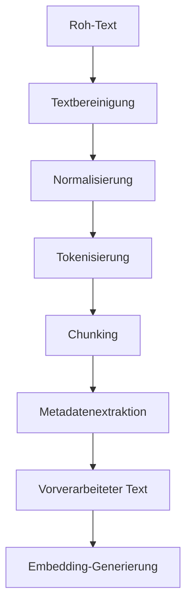

# Text-Preprocessor Service

Der Text-Preprocessor Service ist ein wesentlicher Bestandteil des GenericRAG-Systems, der für die Vorverarbeitung von Textinhalten verantwortlich ist. Dieser Service bereinigt, strukturiert und chunkt extrahierten Text, um ihn für die Embedding-Generierung und Suche optimal aufzubereiten.

## Übersicht

Der Text-Preprocessor Service bietet folgende Funktionen:

- **Textbereinigung**: Entfernt unerwünschte Zeichen und normalisiert Text
- **Tokenisierung**: Teilt Text in sinnvolle Einheiten auf
- **Chunking**: Erzeugt überschaubare Text-Chunks für die Verarbeitung
- **Normalisierung**: Standardisiert Textformate und -strukturen
- **Sprachverarbeitung**: Unterstützt mehrsprachige Textverarbeitung
- **Metadatenextraktion**: Extrahiert zusätzliche Informationen aus Text

## Architektur



## Konfiguration

### Umgebungsvariablen

| Variable | Beschreibung | Standardwert |
|----------|-------------|-------------|
| `TEXT_PREPROCESSOR_CONFIG` | Konfiguration für den Text-Preprocessor | `{"chunk_size": 512, "overlap": 50, "clean_text": true, "normalize_whitespace": true}` |

### Konfigurationsparameter

```python
TEXT_PREPROCESSOR_CONFIG = {
    "chunk_size": 512,                    # Maximale Größe eines Chunks in Token
    "chunk_overlap": 50,                  # Überlappung zwischen Chunks in Token
    "clean_text": True,                   # Textbereinigung aktivieren
    "normalize_whitespace": True,         # Whitespace normalisieren
    "remove_special_chars": True,         # Sonderzeichen entfernen
    "lowercase": True,                    # Text in Kleinbuchstaben umwandeln
    "remove_numbers": False,              # Zahlen entfernen
    "remove_urls": True,                  # URLs entfernen
    "remove_emails": True,                # E-Mail-Adressen entfernen
    "language": "auto",                   # Sprache des Textes (auto, de, en, etc.)
    "sentence_splitter": "nltk",          # Satzsegmentierung (nltk, spacy, regex)
    "paragraph_separator": "\n\n",        # Trennzeichen für Absätze
    "max_chunk_length": 1000,             # Maximale Chunk-Länge
    "min_chunk_length": 50,               # Minimale Chunk-Länge
    "preserve_structure": True,           # Struktur erhalten (Absätze, Listen)
    "remove_duplicates": True,            # Duplikate entfernen
    "stemming": False,                    # Wortstamm reduzieren
    "lemmatization": False,               # Lemmatisierung durchführen
    "remove_stopwords": False,            # Stoppwörter entfernen
    "custom_regex_patterns": [],          # Benutzerdefinierte Regex-Muster
    "chunk_strategy": "recursive",        # Chunking-Strategie (recursive, character, semantic)
    "semantic_chunk_threshold": 0.8,      # Schwellenwert für semantisches Chunking
    "preserve_metadata": True             # Metadaten in Chunks erhalten
}
```

## Installation

Der Text-Preprocessor Service erfordert folgende Abhängigkeiten:

```bash
# Installieren der notwendigen Pakete
uv add nltk spacy regex
python -m spacy download de_core_news_sm
python -m spacy download en_core_web_sm
```

## Verwendung

### Grundlegende Verwendung

```python
from src.app.services.text_preprocessor import TextPreprocessor

# Initialisierung des Services
preprocessor = TextPreprocessor()

# Text vorverarbeiten
raw_text = """
Dies ist ein Beispieltext mit mehreren Sätzen. 
Er enthält verschiedene Informationen und sollte 
in überschaubare Chunks aufgeteilt werden.
"""
processed_chunks = await preprocessor.preprocess_text(raw_text)

# Ergebnisse anzeigen
for i, chunk in enumerate(processed_chunks):
    print(f"Chunk {i+1}: {chunk[:100]}...")
```

### Fortgeschrittene Verwendung

```python
# Mit benutzerdefinierter Konfiguration
config = {
    "chunk_size": 256,
    "chunk_overlap": 25,
    "clean_text": True,
    "normalize_whitespace": True,
    "remove_special_chars": True,
    "language": "de",
    "sentence_splitter": "spacy",
    "chunk_strategy": "recursive"
}

preprocessor = TextPreprocessor(config)
processed_chunks = await preprocessor.preprocess_text(raw_text)

# Ergebnisse mit Metadaten anzeigen
for chunk in processed_chunks:
    print(f"Chunk: {chunk['content'][:100]}...")
    print(f"Metadaten: {chunk['metadata']}")
    print("-" * 50)
```

### Batch-Verarbeitung

```python
# Mehrere Texte vorverarbeiten
texts = [
    "Erster Text mit viel Inhalt...",
    "Zweiter Text mit weniger Inhalt...",
    "Dritter Text mit mittelmäßigem Inhalt..."
]

processed_results = await preprocessor.batch_preprocess(texts)

# Ergebnisse verarbeiten
for i, result in enumerate(processed_results):
    print(f"Text {i+1}: {len(result['chunks'])} Chunks")
    print(f"Verarbeitungszeit: {result['processing_time']:.2f}s")
```

## API-Endpunkte

### Text-Vorverarbeitung

```http
POST /api/v1/text/preprocess
Content-Type: application/json

{
  "text": "Zu verarbeitender Text...",
  "config": {
    "chunk_size": 512,
    "chunk_overlap": 50
  }
}
```

### Batch-Text-Vorverarbeitung

```http
POST /api/v1/text/preprocess/batch
Content-Type: application/json

{
  "texts": ["Text 1", "Text 2", "Text 3"],
  "config": {
    "chunk_size": 512,
    "chunk_overlap": 50
  }
}
```

## Methodenreferenz

### `preprocess_text(text: str, config: Optional[Dict] = None) -> List[Dict]`

Verarbeitet einen einzelnen Text und gibt eine Liste von Chunks zurück.

**Parameter:**
- `text`: Zu verarbeitender Text
- `config`: Optionale Konfiguration für die Verarbeitung

**Rückgabewert:**
- `List[Dict]`: Liste von verarbeiteten Chunks mit Metadaten

### `batch_preprocess(texts: List[str], config: Optional[Dict] = None) -> List[Dict]`

Verarbeitet mehrere Texte im Batch.

**Parameter:**
- `texts`: Liste von zu verarbeitenden Texten
- `config`: Optionale Konfiguration für die Verarbeitung

**Rückgabewert:**
- `List[Dict]`: Liste von Verarbeitungsergebnissen

### `clean_text(text: str) -> str`

Bereinigt den Text durch Entfernen unerwünschter Zeichen und Normalisierung.

**Parameter:**
- `text`: Zu bereinigender Text

**Rückgabertyp:**
- `str`: Bereinigter Text

### `tokenize_text(text: str) -> List[str]`

Tokenisiert den Text in Wörter oder Sätze.

**Parameter:**
- `text`: Zu tokenisierender Text

**Rückgabertyp:**
- `List[str]`: Liste von Tokens

### `create_chunks(text: str, config: Dict) -> List[Dict]`

Erstellt Chunks aus dem verarbeiteten Text.

**Parameter:**
- `text`: Zu chunkender Text
- `config`: Konfiguration für das Chunking

**Rückgabertyp:**
- `List[Dict]`: Liste von Chunks mit Metadaten

### `detect_language(text: str) -> str`

Erkennt die Sprache des Textes.

**Parameter:**
- `text`: Zu analysierender Text

**Rückgabertyp:**
- `str`: Erkannte Sprache (z.B. 'de', 'en')

### `extract_metadata(text: str) -> Dict[str, Any]`

Extrahiert Metadaten aus dem Text.

**Parameter:**
- `text`: Zu analysierender Text

**Rückgabertyp:**
- `Dict[str, Any]`: Extrahierte Metadaten

## Datenstrukturen

### `Chunk`

```python
class Chunk:
    content: str                    # Verarbeiteter Text-Content
    chunk_id: str                   # Eindeutige ID des Chunks
    chunk_type: str                 # Typ des Chunks (text, table, image)
    chunk_index: int                # Index des Chunks
    total_chunks: int               # Gesamtzahl der Chunks
    token_count: int                # Anzahl der Tokens im Chunk
    character_count: int            # Anzahl der Zeichen im Chunk
    language: str                   # Erkannte Sprache
    sentences: List[str]            # Enthaltene Sätze
    paragraphs: List[str]           # Enthaltene Absätze
    metadata: Dict[str, Any]        # Zusätzliche Metadaten
    processing_time: float          # Verarbeitungszeit
    confidence: float               # Verarbeitungsqualität
```

### `ProcessingResult`

```python
class ProcessingResult:
    original_text: str              # Ursprünglicher Text
    processed_text: str             # Verarbeiteter Text
    chunks: List[Chunk]             # Erzeugte Chunks
    processing_time: float          # Gesamtverarbeitungszeit
    language: str                   # Erkannte Sprache
    statistics: Dict[str, Any]      # Verarbeitungsstatistiken
    errors: List[str]               | Aufgetretene Fehler
```

## Chunking-Strategien

### Recursive Chunking

Teilt Text rekursiv basierend auf natürlichen Grenzen (Sätze, Absätze).

```python
config = {
    "chunk_strategy": "recursive",
    "chunk_size": 512,
    "chunk_overlap": 50,
    "sentence_splitter": "spacy"
}
```

### Character Chunking

Teilt Text basierend auf einer festen Zeichenanzahl.

```python
config = {
    "chunk_strategy": "character",
    "chunk_size": 1000,
    "chunk_overlap": 100
}
```

### Semantic Chunking

Teilt Text basierend auf semantischen Grenzen.

```python
config = {
    "chunk_strategy": "semantic",
    "chunk_size": 512,
    "semantic_chunk_threshold": 0.8
}
```

## Textbereinigung

### Standardbereinigung

```python
# Standard-Textbereinigung
cleaned_text = await preprocessor.clean_text(raw_text)
print(cleaned_text)
```

### Benutzerdefinierte Bereinigung

```python
# Mit benutzerdefinierten Regex-Mustern
config = {
    "custom_regex_patterns": [
        r"\b\d{4}-\d{2}-\d{2}\b",  # Datumsmuster
        r"\b[A-Z]{3}\d{3,4}\b",     # Kfz-Kennzeichen
        r"\b\d{3}[-\s]?\d{3}[-\s]?\d{4}\b"  # Telefonnummern
    ]
}

preprocessor = TextPreprocessor(config)
cleaned_text = await preprocessor.clean_text(raw_text)
```

## Metadatenextraktion

### Automatische Metadatenextraktion

```python
# Metadaten extrahieren
metadata = await preprocessor.extract_metadata(raw_text)
print(f"Sprache: {metadata['language']}")
print(f"Sätze: {metadata['sentence_count']}")
print(f"Absätze: {metadata['paragraph_count']}")
print(f"Durchschnittliche Satzlänge: {metadata['avg_sentence_length']}")
```

### Benutzerdefinierte Metadaten

```python
# Benutzerdefinierte Metadaten-Extraktion
custom_metadata = {
    "keywords": await preprocessor.extract_keywords(raw_text),
    "entities": await preprocessor.extract_entities(raw_text),
    "sentiment": await preprocessor.analyze_sentiment(raw_text),
    "readability": await preprocessor.calculate_readability(raw_text)
}
```

## Performance-Optimierung

### Caching

```python
# Caching aktivieren
preprocessor = TextPreprocessor(use_cache=True)

# Cache leeren
preprocessor.clear_cache()
```

### Parallelverarbeitung

```python
# Parallelverarbeitung für Batch-Operationen
config = {
    "parallel_processing": True,
    "max_workers": 4
}

preprocessor = TextPreprocessor(config)
results = await preprocessor.batch_preprocess(large_texts)
```

### Speicheroptimierung

```python
# Stream-Verarbeitung für große Texte
async for chunk in preprocessor.stream_preprocess(large_text_file):
    process_chunk(chunk)
```

## Beispiele

### Beispiel 1: Einfache Textverarbeitung

```python
from src.app.services.text_preprocessor import TextPreprocessor

preprocessor = TextPreprocessor()

# Beispieltext
text = """
Dies ist ein Beispieltext mit mehreren Sätzen. 
Er enthält verschiedene Informationen und sollte 
in überschaubare Chunks aufgeteilt werden. 
Der Text dient zur Demonstration der Funktionalität.
"""

# Text verarbeiten
chunks = await preprocessor.preprocess_text(text)

# Ergebnisse anzeigen
for i, chunk in enumerate(chunks):
    print(f"Chunk {i+1}: {chunk['content']}")
    print(f"Metadaten: {chunk['metadata']}")
    print("-" * 50)
```

### Beispiel 2: Fortgeschrittene Textverarbeitung

```python
# Mit erweiterter Konfiguration
config = {
    "chunk_size": 256,
    "chunk_overlap": 25,
    "clean_text": True,
    "normalize_whitespace": True,
    "remove_special_chars": True,
    "language": "de",
    "sentence_splitter": "spacy",
    "chunk_strategy": "recursive",
    "preserve_structure": True,
    "remove_duplicates": True
}

preprocessor = TextPreprocessor(config)

# Komplexen Text verarbeiten
complex_text = """
Absatz 1: Dies ist der erste Absatz mit mehreren Sätzen. 
Er enthält wichtige Informationen für die Verarbeitung.

Absatz 2: Der zweite Absatz hat einen anderen Fokus. 
Hier werden andere Aspekte behandelt.

Liste:
- Punkt 1
- Punkt 2
- Punkt 3

Absatz 3: Der letzte Absatz fasst die Ergebnisse zusammen.
"""

chunks = await preprocessor.preprocess_text(complex_text)

# Strukturierte Ergebnisse anzeigen
for chunk in chunks:
    print(f"Typ: {chunk['metadata']['chunk_type']}")
    print(f"Absätze: {len(chunk['metadata']['paragraphs'])}")
    print(f"Sätze: {len(chunk['metadata']['sentences'])}")
    print(f"Content: {chunk['content'][:100]}...")
    print("-" * 50)
```

### Beispiel 3: Batch-Verarbeitung

```python
# Mehrere Texte verarbeiten
texts = [
    "Erster Text mit viel Inhalt und vielen Informationen...",
    "Zweiter Text mit weniger Inhalt...",
    "Dritter Text mit mittelmäßigem Inhalt und speziellen Anforderungen..."
]

# Batch-Verarbeitung durchführen
results = await preprocessor.batch_preprocess(texts)

# Ergebnisse analysieren
for i, result in enumerate(results):
    print(f"Text {i+1}:")
    print(f"  - Original: {len(result['original_text'])} Zeichen")
    print(f"  - Verarbeitet: {len(result['processed_text'])} Zeichen")
    print(f"  - Chunks: {len(result['chunks'])}")
    print(f"  - Sprache: {result['language']}")
    print(f"  - Verarbeitungszeit: {result['processing_time']:.2f}s")
    print("-" * 30)
```

### Beispiel 4: Metadatenanalyse

```python
# Metadaten extrahieren und analysieren
text = """
Dies ist ein Beispieltext für die Metadatenanalyse. 
Er enthält mehrere Sätze und Absätze zur Demonstration.
Die Sprache ist Deutsch und der Text ist relativ lang.
"""

metadata = await preprocessor.extract_metadata(text)

print("Extrahierte Metadaten:")
for key, value in metadata.items():
    print(f"  {key}: {value}")

# Statistiken anzeigen
stats = await preprocessor.get_text_statistics(text)
print("\nTextstatistiken:")
for key, value in stats.items():
    print(f"  {key}: {value}")
```

## Troubleshooting

### Häufige Probleme

1. **Chunking funktioniert nicht korrekt**
   - Lösung: `chunk_strategy` und `chunk_size` überprüfen
   - Alternative: Manuelles Chunking implementieren

2. **Spracherkennung funktioniert nicht**
   - Lösung: Sprache manuell angeben oder andere Bibliothek verwenden
   - Alternative: `language` Parameter auf "auto" setzen

3. **Textbereinigung entfernt wichtige Informationen**
   - Lösung: `remove_special_chars` und `remove_numbers` anpassen
   - Alternative: Benutzerdefinierte Regex-Muster verwenden

4. **Performance-Probleme bei großen Texten**
   - Lösung: Parallelverarbeitung aktivieren
   - Alternative: Stream-Verarbeitung verwenden

### Debug-Modus

```python
# Debug-Informationen aktivieren
preprocessor = TextPreprocessor(debug=True)
chunks = await preprocessor.preprocess_text(text)

# Detaillierte Logs anzeigen
for log in chunks[0]['metadata']['debug_logs']:
    print(f"{log['timestamp']}: {log['message']}")
```

## Weiterführende Informationen

- [NLTK-Dokumentation](https://www.nltk.org/)
- [spaCy-Dokumentation](https://spacy.io/)
- [Regex-Dokumentation](https://docs.python.org/3/library/re.html)
- [Text Processing Best Practices](https://towardsdatascience.com/text-preprocessing-for-natural-language-processing-5ac8f710a8a3)