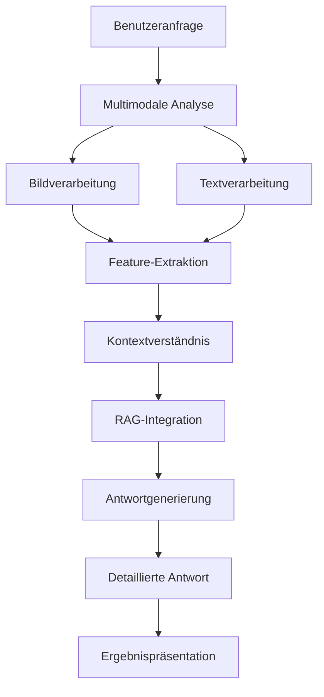

# VLM Service

Der VLM (Vision-Language Model) Service ist ein fortschrittlicher Bestandteil des GenericRAG-Systems, der die Fähigkeit hat, sowohl Text als auch Bilder zu verstehen und darauf zu antworten. Dieser Service integriert multimodale Modelle, um komplexe Fragen zu beantworten, die sowohl visuelle als auch textuelle Informationen erfordern.

## Übersicht

Der VLM Service bietet folgende Funktionen:

- **Multimodale Verarbeitung**: Verarbeitet sowohl Text als auch Bilder
- **Bildbasierte Fragen**: Beantwortet Fragen zu Bildinhalten
- **Dokumentenanalyse**: Analysiert komplexe Dokumente mit Text und Bildern
- **Konversationsführung**: Führt kontextbezogene Dialoge
- **Ergebnisgenerierung**: Generiert detaillierte Antworten mit Erklärungen
- **Integration mit RAG**: Kombiniert Retrieval-Augmented Generation mit multimodaler Verarbeitung

## Architektur



## Konfiguration

### Umgebungsvariablen

| Variable | Beschreibung | Standardwert |
|----------|-------------|-------------|
| `VLM_SERVICE_CONFIG` | Konfiguration für den VLM Service | `{"model_name": "llava", "temperature": 0.7, "max_tokens": 1000, "enable_rag": true}` |

### Konfigurationsparameter

```python
VLM_SERVICE_CONFIG = {
    "model_name": "llava",                  # VLM-Modellname
    "model_endpoint": "http://localhost:11434", # Modell-Endpunkt
    "temperature": 0.7,                     # Temperatur für Antwortgenerierung
    "max_tokens": 1000,                     # Maximale Token in der Antwort
    "enable_rag": True,                      # RAG-Integration aktivieren
    "enable_image_analysis": True,           # Bildanalyse aktivieren
    "enable_text_analysis": True,             # Textanalyse aktivieren
    "enable_multimodal_analysis": True,      # Multimodale Analyse aktivieren
    "context_length": 4096,                 # Kontextlänge
    "top_p": 0.9,                           # Top-P Sampling
    "top_k": 50,                            # Top-K Sampling
    "repetition_penalty": 1.1,              # Wiederholungsstrafe
    "enable_debug_logging": False,          # Debug-Logging aktivieren
    "cache_responses": True,                 # Antworten cachen
    "cache_ttl": 3600,                      # Cache-TTL in Sekunden
    "enable_streaming": True,                # Streaming aktivieren
    "streaming_timeout": 30,                 # Streaming-Timeout
    "enable_explainability": False,          # Erklärbarkeit aktivieren
    "explanation_method": "attention",       # Erklärungsmethode
    "enable_confidence_scoring": True,       # Konfidenzbewertung aktivieren
    "confidence_threshold": 0.5,             # Konfidenzschwelle
    "enable_multilingual": True,            | Mehrsprachigkeit aktivieren
    "supported_languages": ["en", "de"],    | Unterstützte Sprachen
    "enable_image_captioning": True,        | Bildbeschriftung aktivieren
    "enable_object_detection": True,        | Objekterkennung aktivieren
    "enable_scene_understanding": True,     | Szenenverständnis aktivieren
    "enable_ocr": True,                     | Texterkennung aktivieren
    "enable_visual_question_answering": True | Visuelle Fragebeantwortung aktivieren
}
```

## Installation

Der VLM Service erfordert folgende Abhängigkeiten:

```bash
# Installieren der notwendigen Pakete
uv add openai requests pillow transformers torch
```

## Verwendung

### Grundlegende Verwendung

```python
from src.app.services.vlm_service import VLMService

# Initialisierung des Services
vlm_service = VLMService()

# Multimodale Anfrage verarbeiten
query = "Was ist auf diesem Bild zu sehen?"
image_path = "example.jpg"
response = await vlm_service.process_multimodal_query(
    query=query,
    image_path=image_path
)

# Antwort anzeigen
print(f"Antwort: {response['answer']}")
print(f"Konfidenz: {response['confidence']:.2f}")
print(f"Erklärung: {response['explanation']}")
```

### Fortgeschrittene Verwendung

```python
# Mit benutzerdefinierter Konfiguration
config = {
    "model_name": "llava",
    "temperature": 0.5,
    "max_tokens": 1500,
    "enable_rag": True,
    "enable_explainability": True
}

vlm_service = VLMService(config)

# Komplexe multimodale Anfrage
response = await vlm_service.process_multimodal_query(
    query="Analysiere dieses technische Diagramm und erkläre die Hauptkomponenten",
    image_path="technical_diagram.jpg",
    context={"document_type": "technical", "domain": "engineering"}
)
```

### Dokumentenanalyse

```python
# Dokumentenanalyse mit mehreren Bildern
response = await vlm_service.analyze_document(
    image_paths=["page1.jpg", "page2.jpg", "page3.jpg"],
    query="Zusammenfasse die Hauptpunkte dieses Dokuments",
    document_type="report"
)
```

## API-Endpunkte

### Multimodale Anfrage

```http
POST /api/v1/vlm/query
Content-Type: application/json

{
  "query": "Was ist auf diesem Bild zu sehen?",
  "image_path": "path/to/image.jpg",
  "context": {
    "document_type": "general",
    "domain": "general"
  }
}
```

### Dokumentenanalyse

```http
POST /api/v1/vlm/analyze
Content-Type: application/json

{
  "image_paths": ["page1.jpg", "page2.jpg"],
  "query": "Analysiere dieses Dokument",
  "document_type": "report",
  "analysis_type": "summary"
}
```

### Bildbeschriftung

```http
POST /api/v1/vlm/caption
Content-Type: application/json

{
  "image_path": "path/to/image.jpg",
  "caption_type": "detailed",
  "include_explanation": true
}
```

### Visuelle Fragebeantwortung

```http
POST /api/v1/vlm/vqa
Content-Type: application/json

{
  "image_path": "path/to/image.jpg",
  "question": "Was ist die Hauptfarbe in diesem Bild?",
  "question_type": "color_analysis"
}
```

## Methodenreferenz

### `process_multimodal_query(query: str, image_path: Optional[str] = None, context: Optional[Dict] = None) -> Dict`

Verarbeitet eine multimodale Anfrage mit Text und optional Bild.

**Parameter:**
- `query`: Text-Anfrage
- `image_path`: Optionaler Pfad zum Bild
- `context`: Optionaler Kontext

**Rückgabertyp:**
- `Dict`: Antwort mit Ergebnis, Konfidenz und Erklärung

### `analyze_document(image_paths: List[str], query: str, document_type: str, analysis_type: str = "summary") -> Dict`

Analysiert ein Dokument mit mehreren Bildern.

**Parameter:**
- `image_paths`: Liste von Bildpfaden
- `query`: Analyseanfrage
- `document_type`: Typ des Dokuments
- `analysis_type`: Typ der Analyse

**Rückgabertyp:**
- `Dict`: Analyseergebnisse

### `generate_image_caption(image_path: str, caption_type: str = "detailed", include_explanation: bool = False) -> Dict`

Generiert eine Bildbeschriftung.

**Parameter:**
- `image_path`: Pfad zum Bild
- `caption_type`: Typ der Beschriftung
- `include_explanation`: Ob Erklärung enthalten sein soll

**Rückgabertyp:**
- `Dict`: Bildbeschriftung und Erklärung

### `answer_visual_question(image_path: str, question: str, question_type: str = "general") -> Dict`

Beantwortet eine Frage zu einem Bild.

**Parameter:**
- `image_path`: Pfad zum Bild
- `question`: Frage zum Bild
- `question_type`: Typ der Frage

**Rückgabertyp:**
- `Dict`: Antwort auf die Frage

### `stream_multimodal_response(query: str, image_path: Optional[str] = None, context: Optional[Dict] = None) -> AsyncGenerator[str, None]`

Streamt eine multimodale Antwort asynchron.

**Parameter:**
- `query`: Text-Anfrage
- `image_path`: Optionaler Pfad zum Bild
- `context`: Optionaler Kontext

**Rückgabertyp:**
- `AsyncGenerator[str, None]`: Generator für gestreamte Antworten

## Datenstrukturen

### `VLMResponse`

```python
class VLMResponse:
    answer: str                              # Generierte Antwort
    confidence: float                        # Konfidenz-Score
    explanation: Optional[str]              | Erklärung der Antwort
    processing_time: float                   | Verarbeitungszeit
    model_used: str                          | Verwendetes Modell
    tokens_used: int                         | Verwendete Token
    image_analysis: Optional[Dict]           | Bildanalyse
    text_analysis: Optional[Dict]            | Textanalyse
    multimodal_analysis: Optional[Dict]      | Multimodale Analyse
    context: Optional[Dict]                 | Verwendeter Kontext
    error: Optional[str]                    | Aufgetretener Fehler
    metadata: Dict[str, Any]                 | Zusätzliche Metadaten
```

### `ImageAnalysis`

```python
class ImageAnalysis:
    objects: List[Dict]                      | Erkannte Objekte
    colors: List[Dict]                      | Farbpalette
    scene: str                               | Szenenbeschreibung
    caption: str                             | Bildbeschriftung
    ocr_text: Optional[str]                 | OCR-Text
    detected_text: List[Dict]               | Erkannter Text
    visual_elements: List[Dict]             | Visuelle Elemente
    composition: Dict                       | Bildkomposition
    quality_metrics: Dict                    | Qualitätsmetriken
```

### `DocumentAnalysis`

```python
class DocumentAnalysis:
    summary: str                             | Zusammenfassung
    key_points: List[str]                    | Schlüsselpunkte
    structure: Dict                          | Dokumentenstruktur
    content_type: str                       | Inhaltstyp
    page_count: int                         | Seitenanzahl
    main_topics: List[str]                  | Hauptthemen
    extracted_data: Dict                     | Extrahierte Daten
    visual_elements: List[Dict]             | Visuelle Elemente
    text_content: str                       | Textinhalt
    metadata: Dict[str, Any]                | Metadaten
```

## Multimodale Analyse

### Bildanalyse

```python
# Bildanalyse durchführen
image_path = "example.jpg"
analysis = await vlm_service.analyze_image(image_path)

# Ergebnisse anzeigen
print(f"Objekte: {analysis['objects']}")
print(f"Farben: {analysis['colors']}")
print(f"Szene: {analysis['scene']}")
print(f"Beschriftung: {analysis['caption']}")
```

### Textanalyse

```python
# Textanalyse durchführen
text = "Dies ist ein Beispieltext für die Analyse."
analysis = await vlm_service.analyze_text(text)

# Ergebnisse anzeigen
print(f"Sentiment: {analysis['sentiment']}")
print(f"Themen: {analysis['topics']}")
print(f"Schlüsselwörter: {analysis['keywords']}")
```

### Multimodale Analyse

```python
# Kombinierte Text- und Bildanalyse
response = await vlm_service.process_multimodal_query(
    query="Erkläre, was auf diesem Bild passiert und wie es sich auf den Text bezieht",
    image_path="image_with_text.jpg",
    context={"document_type": "mixed", "analysis_type": "comprehensive"}
)

# Ergebnisse anzeigen
print(f"Antwort: {response['answer']}")
print(f"Konfidenz: {response['confidence']:.2f}")
print(f"Erklärung: {response['explanation']}")
```

## RAG-Integration

### Mit RAG-Unterstützung

```python
# VLM mit RAG-Integration
response = await vlm_service.process_multimodal_query(
    query="Wie funktioniert maschinelles Lernen?",
    image_path="ml_diagram.jpg",
    context={
        "enable_rag": True,
        "retrieval_query": "machine learning basics",
        "session_id": "session-123"
    }
)

# Ergebnisse anzeigen
print(f"Antwort: {response['answer']}")
print(f"Quellen: {response['sources']}")
print(f"Relevanz: {response['relevance_score']}")
```

### Kontextbasierte Analyse

```python
# Analyse mit spezifischem Kontext
response = await vlm_service.process_multimodal_query(
    query="Analysiere diese technische Zeichnung",
    image_path="technical_drawing.jpg",
    context={
        "domain": "engineering",
        "document_type": "technical",
        "specialization": "mechanical"
    }
)
```

## Streaming und Echtzeit-Antworten

### Streaming-Antwort

```python
# Streaming-Antwort verarbeiten
query = "Beschibe dieses Bild im Detail"
image_path = "complex_image.jpg"

async for chunk in vlm_service.stream_multimodal_response(query, image_path):
    print(chunk, end="", flush=True)
```

### Echtzeit-Interaktion

```python
# Echtzeit-Interaktion mit dem VLM
async def interactive_vlm():
    while True:
        query = input("Ihre Frage (oder 'exit' zum Beenden): ")
        if query.lower() == 'exit':
            break
            
        image_path = input("Bildpfad (oder leer lassen): ") or None
        
        async for chunk in vlm_service.stream_multimodal_response(query, image_path):
            print(chunk, end="", flush=True)
        print()  # Neue Zeile am Ende

# Interaktiven Modus starten
import asyncio
asyncio.run(interactive_vlm())
```

## Beispiele

### Beispiel 1: Einfache multimodale Anfrage

```python
from src.app.services.vlm_service import VLMService

# Service initialisieren
vlm_service = VLMService()

# Einfache multimodale Anfrage
query = "Was ist auf diesem Bild zu sehen?"
image_path = "example.jpg"
response = await vlm_service.process_multimodal_query(
    query=query,
    image_path=image_path
)

# Ergebnisse anzeigen
print(f"Frage: {query}")
print(f"Antwort: {response['answer']}")
print(f"Konfidenz: {response['confidence']:.2f}")
print(f"Verarbeitungszeit: {response['processing_time']:.2f}s")
```

### Beispiel 2: Dokumentenanalyse

```python
# Dokumentenanalyse mit mehreren Bildern
image_paths = ["page1.jpg", "page2.jpg", "page3.jpg"]
response = await vlm_service.analyze_document(
    image_paths=image_paths,
    query="Zusammenfasse die Hauptpunkte dieses technischen Berichts",
    document_type="technical_report",
    analysis_type="summary"
)

# Ergebnisse anzeigen
print(f"Zusammenfassung: {response['summary']}")
print(f"Schlüsselpunkte:")
for point in response['key_points']:
    print(f"  - {point}")
print(f"Struktur: {response['structure']}")
```

### Beispiel 3: Bildbeschriftung

```python
# Detaillierte Bildbeschriftung
response = await vlm_service.generate_image_caption(
    image_path="landscape.jpg",
    caption_type="detailed",
    include_explanation=True
)

# Ergebnisse anzeigen
print(f"Beschriftung: {response['caption']}")
print(f"Erklärung: {response['explanation']}")
print(f"Objekte: {response['objects']}")
print(f"Farben: {response['colors']}")
```

### Beispiel 4: Visuelle Fragebeantwortung

```python
# Spezifische Frage zu einem Bild
response = await vlm_service.answer_visual_question(
    image_path="cityscape.jpg",
    question="Wie viele Wolkenkratzer sind in diesem Bild zu sehen?",
    question_type="object_counting"
)

# Ergebnisse anzeigen
print(f"Frage: {response['question']}")
print(f"Antwort: {response['answer']}")
print(f"Erklärung: {response['explanation']}")
print(f"Konfidenz: {response['confidence']:.2f}")
```

### Beispiel 5: Streaming-Antwort

```python
# Streaming-Antwort für komplexe Analyse
query = "Analysiere dieses Kunstwerk im Detail und erkläre die künstlerischen Techniken"
image_path = "artwork.jpg"

print("Streaming-Antwort:")
async for chunk in vlm_service.stream_multimodal_response(query, image_path):
    print(chunk, end="", flush=True)
print()  # Neue Zeile am Ende
```

## Troubleshooting

### Häufige Probleme

1. **Bild kann nicht geladen werden**
   - Lösung: Bildpfad und Dateiformat überprüfen
   - Alternative: Bilddaten als Bytes übergeben

2. **Antwort ist nicht relevant**
   - Lösung: `temperature` anpassen oder mehr Kontext bereitstellen
   - Alternative: RAG-Integration aktivieren

3. **Verarbeitung ist zu langsam**
   - Lösung: Streaming aktivieren oder kleinere Bilder verwenden
   - Alternative: Modell wechseln

4. **Multimodale Analyse funktioniert nicht**
   - Lösung: Bild- und Textanalyse separat testen
   - Alternative: Kontext prüfen

### Debug-Modus

```python
# Debug-Informationen aktivieren
vlm_service = VLMService(enable_debug_logging=True)

# Anfrage mit Debug-Logs
response = await vlm_service.process_multimodal_query(
    query="Test Query",
    image_path="test.jpg"
)

# Debug-Logs anzeigen
for log in vlm_service.debug_logs:
    print(f"{log['timestamp']}: {log['message']}")
```

## Weiterführende Informationen

- [LLaVA-Dokumentation](https://llava-vl.github.io/)
- [Multimodal AI Models](https://huggingface.co/docs/transformers/main/en/model_doc/llava)
- [Vision-Language Models](https://arxiv.org/abs/2304.03613)
- [Multimodal Processing](https://towardsdatascience.com/multimodal-ai-combining-text-and-images-for-better-ai-8d8b5b5b5b5)
- [RAG with Multimodal Models](https://towardsdatascience.com/retrieval-augmented-generation-for-multimodal-ai-5f5f5f5f5f5)